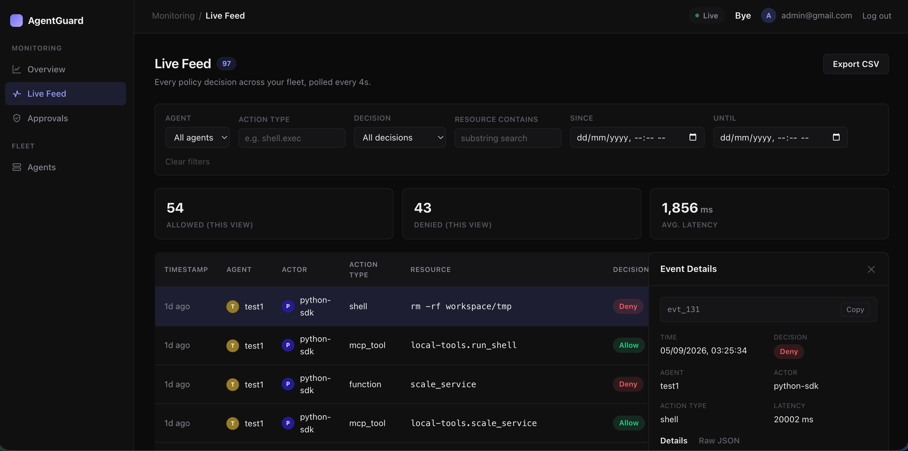
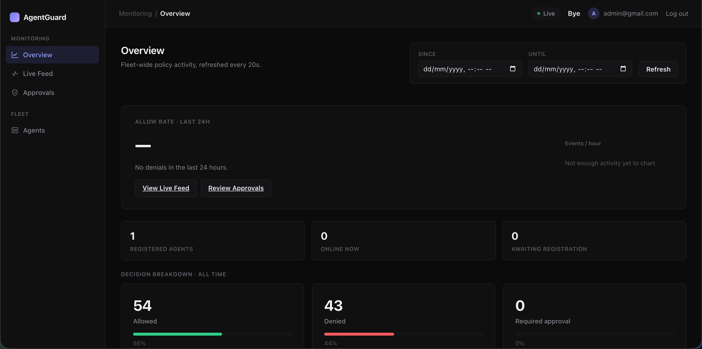

# AgentGuard

A developer-first **policy-as-code layer for AI agents**. Declare exactly what an
agent's tool calls are allowed to touch — files, network domains, shell commands,
MCP tools, secrets — in a version-controlled `policy.yaml`, and have it **enforced
at the point of action**, not logged about after the fact.

Everything runs locally by default (no dependency on AgentGuard's infrastructure to
enforce a decision) with an optional hosted dashboard for fleet-wide visibility
across every agent a company runs, across multiple companies.

## Screenshots

<!--
  Drop PNGs into docs/screenshots/ using the filenames below and they'll show up
  here automatically. Suggested shots: the Overview page (hero card + sparkline),
  the Live Feed master-detail view, and the Pending Approvals queue.
-->





## Why

Most "AI security" tools today either detect-and-alert after something already
happened, or isolate an agent in a sandbox with no policy layer at all. AgentGuard
sits in between: a single policy decision point (PDP) that every enforcement
surface — an SDK-wrapped tool call, an MCP proxy, a network egress proxy, a
hardened shell — calls into before an action runs, so a rule is defined once and
enforced everywhere.

## Key features

- **Policy-as-code**: one YAML file governs filesystem, network, shell, MCP tool,
  and secret-handling rules, with `allow` / `deny` / `require_approval` outcomes.
- **Enforced at the point of action**, across four surfaces: an SDK tool-call
  wrapper (Python & TypeScript), an MCP stdio proxy, a TLS-intercepting network
  egress proxy, and OS-level hardening (macOS `sandbox-exec`).
- **Human-in-the-loop approvals**: risky actions can pause for a real approval,
  resolved via the CLI, Slack/webhook, or the cloud dashboard's browser UI.
- **CI-testable policies**: `agentctl policy test` runs a policy against a
  recorded set of traces so a policy change gets regression-tested like code.
- **Multi-tenant cloud dashboard**: fleet-wide event feed, metrics, and remote
  approve/deny across every agent a company runs — strictly additive, so the
  local daemon keeps enforcing policy even if the cloud is unreachable.

## Architecture

```
 Agent process                          AgentGuard (local, always-on enforcement)
 ──────────────                         ─────────────────────────────────────────
 Python/TS SDK  ──┐
 MCP client     ──┼── enforcement ──▶   local daemon (Unix socket)
 shell/network  ──┘     surfaces          │
                                          ├─ policy engine (PDP): Evaluate(policy, action)
                                          ├─ audit log (JSONL) + approval broker
                                          └─ Slack/webhook escalation

                                          │ optional, additive
                                          ▼
                                   agentguard-forwarder (tails the audit log,
                                   relays approvals — one new local process)
                                          │ HTTPS
                                          ▼
                              AgentGuard Cloud (hosted, multi-tenant)
                              Control API + Web API + Postgres + React dashboard
```

## Repo layout

```
/policy-spec/     # YAML policy DSL schema + example policies
/engine/          # Go: the policy decision point (PDP) — Evaluate(policy, action) -> Decision
/daemon/          # Go: local sidecar daemon (Unix socket API, audit log, approval broker)
/proxy/mcp/       # Go: MCP stdio proxy — intercepts tools/call against policy
/proxy/network/   # Go: TLS-intercepting egress proxy
/hardened/        # Go: OS-level hardened execution (macOS sandbox-exec)
/cli/             # Go: the `agentctl` CLI
/sdk-python/      # Python SDK (agentguard package): Guard, wrap_tools(), framework adapters
/sdk-ts/          # TypeScript SDK (agentguard package), native Node 22.6+ execution
/dashboard/       # Go + Postgres: multi-tenant cloud backend (Control API + Web API)
/dashboard/web/   # React + TypeScript: the cloud dashboard frontend
/cmd/             # Binaries: agentguard-cloud, agentguard-forwarder
/examples/        # Example agents wired to the SDK / MCP proxy
/docs/            # Additional guides (SDK usage, etc.)
```

## Quick start

### Prerequisites

- Go 1.26+
- Python 3.10+ (for the Python SDK / example agent)
- Node.js 22.6+ (for the TypeScript SDK and the dashboard frontend)
- Postgres (only needed for the cloud dashboard — skip if you're only running
  local enforcement)

### 1. Build the CLI

```bash
go build -o bin/agentctl ./cli/cmd/agentctl
```

### 2. Write a policy and start the daemon

```bash
./bin/agentctl init                 # writes a starter policy.yaml
./bin/agentctl daemon start --policy policy.yaml
```

### 3. Wrap your agent

Python:

```python
from agentguard import Guard

guard = Guard(policy="policy.yaml")  # starts the daemon if one isn't already running
tools = guard.wrap_tools([search_tool, file_write_tool, shell_tool])
agent = create_react_agent(llm, tools)  # rest of your agent code is unchanged
```

TypeScript:

```typescript
import { Guard } from "agentguard";

const guard = await Guard.create("policy.yaml");
const tools = guard.wrapTools([searchTool, writeFileTool, shellTool]);
```

Or enforce a command with zero code changes via the network proxy / hardened
runner:

```bash
./bin/agentctl run --policy policy.yaml -- python my_agent.py
```

Anything the policy marks `require_approval` shows up via:

```bash
./bin/agentctl pending
./bin/agentctl approve <id>   # or: agentctl deny <id>
```

### 4. (Optional) Cloud dashboard for fleet visibility

```bash
createdb agentguard_dashboard_dev

# Terminal 1 — backend (Control API + Web API), migrates the schema on boot
go run ./cmd/agentguard-cloud

# Terminal 2 — frontend
cd dashboard/web && npm install && npm run dev

# Terminal 3 — on each machine running an agent: sign up / add an agent in the
# dashboard to get a one-time registration token, then:
go run ./cmd/agentguard-forwarder -register-token=<token from the dashboard>
```

Open the frontend's dev server URL, sign up, and add an agent — the forwarder
ships that machine's audit log and relays browser approve/deny decisions back to
its local daemon. The cloud is strictly additive: local enforcement keeps working
even if it's unreachable.

## Contributing

Read `docs/conventions.md` before adding code. It records the one rule this repo
enforces on itself: never a second implementation of something that already
exists, and a written justification in `CHANGELOG.md` for every new symbol.

## Testing

```bash
go test -p 1 ./...        # -p 1: dashboard packages share one real Postgres test DB
cd sdk-python && pytest
cd sdk-ts && npm test
cd dashboard/web && npm run build
```

## Status

Actively developed. Local enforcement (v0.1/v0.2: policy engine, daemon, MCP
proxy, network proxy, CLI, Python/TS SDKs, macOS hardened mode, CI policy
testing, Slack/webhook approvals) is built and tested. The cloud dashboard is
Phase 1 (multi-tenant backend + forwarder + React frontend); see `CHANGELOG.md`
for the full build log and design rationale behind every piece.

## License

MIT — see `LICENSE`.
